# Vincent Boufaroua — Robotics & Software Engineer

Hi! My name is Vincent and I'm a robotics & software engineering student (M.Sc., France/Japan dual degree).  
I like building and programming systems, robots, or whatever I can get my hands on.  
Can be found at 2am in the lab, trying to fix a problem nobody asked me to solve.

## 🎓 Education

<table>
<tr>
<td>🇯🇵</td>
<td>

**M.Sc., Computer Science & Systems Engineering**  —  iART Program  
Kyushu Institute of Technology  •  Iizuka, Japan  
Sep 2024 – Sep 2026

</td>
</tr>
<tr>
<td>🇫🇷</td>
<td>

**M.Eng. (Grande École)**  —  Ingénieur Civil des Mines (ICM)  
École Nationale Supérieure des Mines de Saint-Étienne  •  Saint-Étienne, France  
Sep 2022 – Sep 2026

</td>
</tr>
<tr>
<td>🇫🇷</td>
<td>

**Preparatory Classes for French Grandes Écoles**  —  (PCSI/PSI*)  
Jean Perrin High School  •  Marseille, France  
Sep 2020 – Jul 2022

</td>
</tr>
</table>

## 🛠️ Skills

**Languages & Frameworks**  

**Also Familiar With**  

**Currently Learning**  

**Robotics**  

**Sensors & Perception**  

**Embedded & Hardware**  

**Tools**  

## 🚀 Projects

Click on the project you want to learn more about

<b>Terrain-Aware Autonomous Navigation Framework</b> — Master Thesis, ROS2/Nav2, LiDAR, SLAM

 

> Designed and implemented an autonomous navigation framework for off-road robots, fusing geometric and semantic terrain analysis into a unified ROS2/Nav2 costmap.
>
> - Built custom ROS2/Nav2 costmap plugins integrating LiDAR-based slope estimation, OCRNet semantic segmentation, and RTAB-Map 3D mapping
> - Built a Unity-ROS2 simulation bridge for large-scale outdoor navigation testing
> - Achieved an **85% mission success rate** (17/20 trials) vs. 0% for geometry-only or semantic-only baselines
> - Presented at **ICAROB 2026**, an international robotics conference
> - A separate paper on this work is currently under review
>  
> 

> 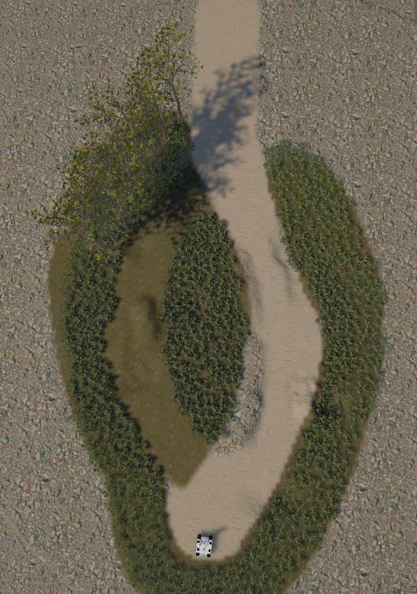 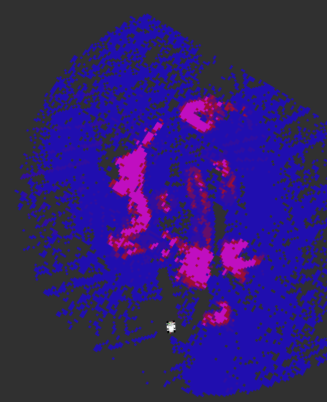  
> 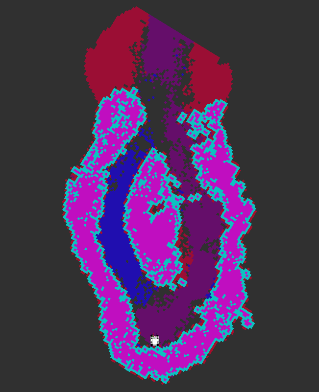 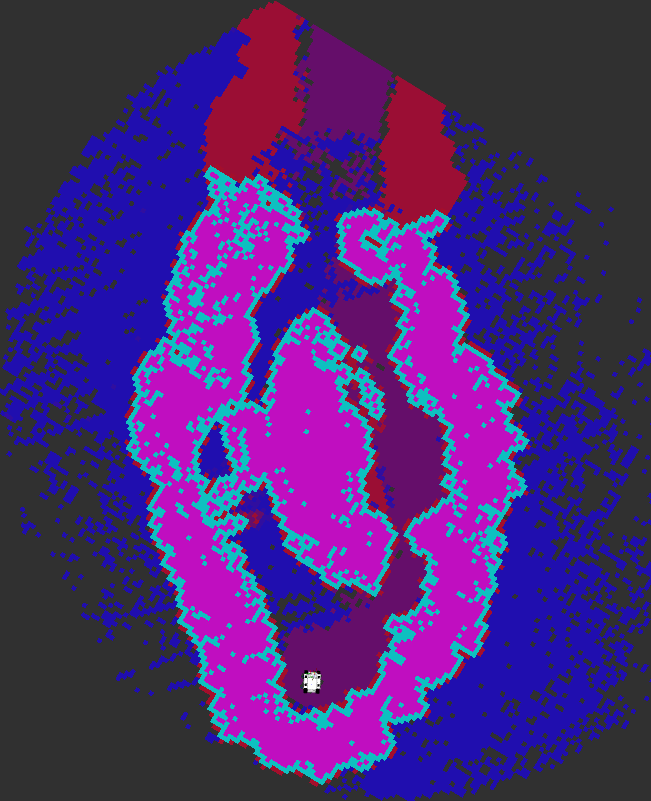  
> 

>
> `ROS2` `C++` `Python` `LiDAR` `Semantic Segmentation` `SLAM` `Unity`

<b>Yamaha YK400XE Robot Migration to ROS2</b> — C++, ROS2, PyQt5

 

> > [!NOTE]  
> > Github repository available on <a href="https://github.com/Sappy27/yk400xe_ros2">yk400xe_ros2</a>
> 
> Ported an industrial Yamaha YK400XE robot controller to the ROS2 ecosystem on Ubuntu 24.04.
> 
> - Wrote C++ communication modules bridging proprietary controller protocols and ROS2 nodes
> - Implemented motion control, status monitoring, and command execution
> - Built PyQt5 GUIs for real-time robot control and position command execution
> - Designed and built an aluminum-frame table to mount the robot, with CAD for the structure
> - Added two supplementary emergency-stops (physical button + RF relay) for more safety
> - Set up a vacuum pump and relay for vacuum control via ROS2, and designed a vacuum gripper for the robot
> - Wrote documentation for other students to set up and use the robot  
>   
> 

>
> 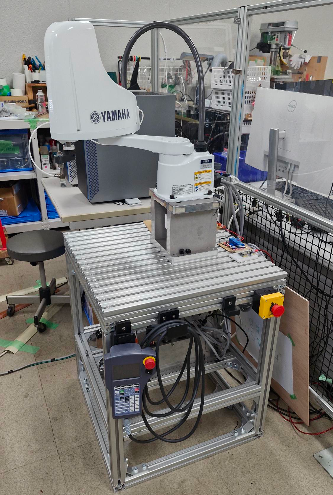 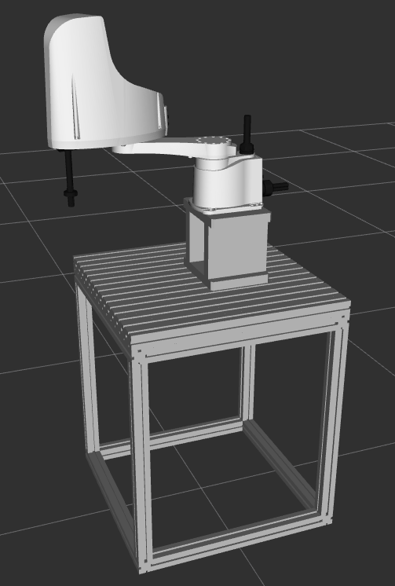
>
> 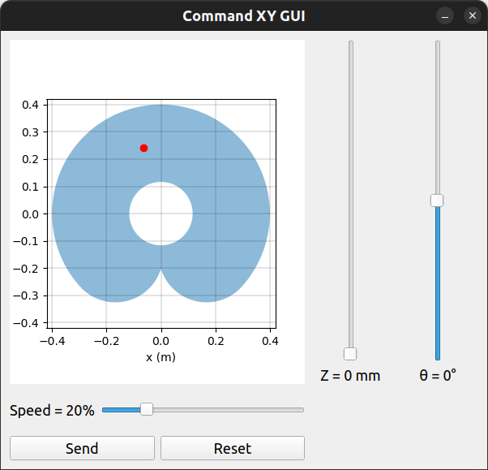 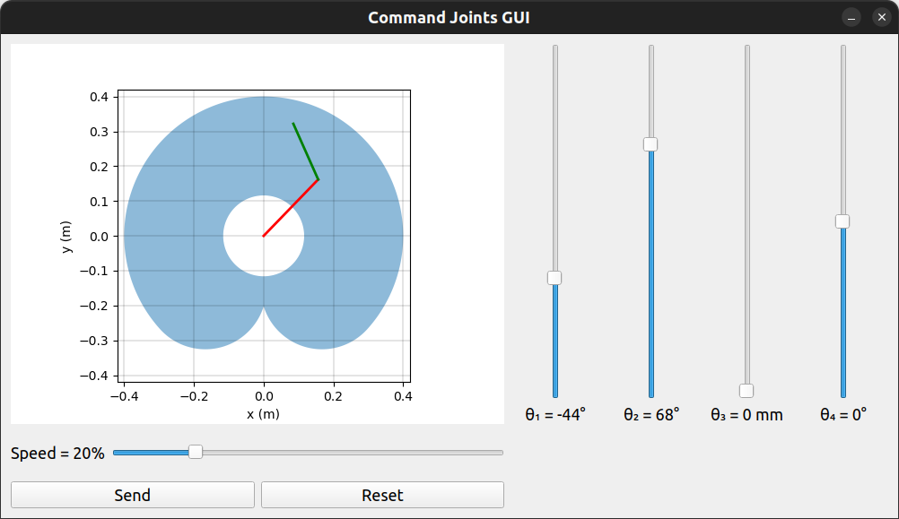
>
> `C++` `Python` `ROS2` `PyQt5` `Hardware` `CAD`
> 

<b>Automated Fish Vaccination System</b> — ESP32, RealSense D405, Embedded

 

> Built the software stack for an automated fish-vaccination prototype for an industrial client.
>
> - Used a RealSense D405 RGB-D camera to detect the vaccination spot
> - Embedded C/C++ control using an ESP32 and linear actuators
> - Designed a custom PCB in KiCad for the system's electronics
> - Designed the CAD for the system's mechanical structure
> - Prototype validated by the client and approved for production
> 
> `ROS2` `ESP32` `C/C++` `RealSense` `CAD` `3D Printing` `Linear Actuators` `KiCad` `PCB` 

<b>Reverse Engineering of a TriOrb Omnidirectional Robot</b> — Electronics, Kinematics, Embedded Control

   

> > [!NOTE]  
> > In collaboration with <a href="https://github.com/Freshman25">@Anna29545</a> 
>   
> Reverse-engineered an undocumented omnidirectional robot's PCB, kinematics, and control architecture from hardware alone.
>
> - Traced the PCB and redrew its electrical schematic in KiCad
> - Derived the robot's kinematics equations through mathematical analysis of its hardware configuration
> - Designed the conversion of Twist commands into motor commands for industrial BLVD-KRD brushless motor drivers
>
> 

> 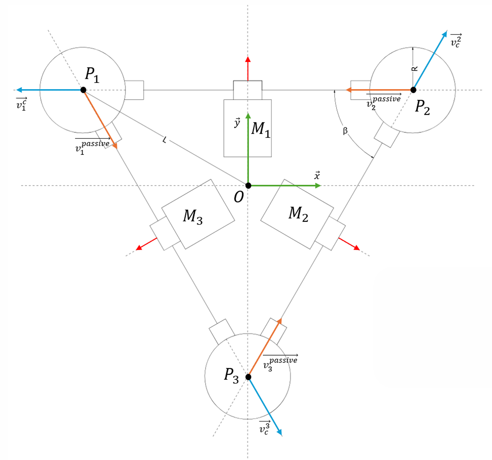 
> 

>
> `Reverse Engineering` `Kinematics` `Embedded` `Electronics` `Industrial Motors` 

<b>Balancing Robot on Hoverboard Wheels</b> — ESP32, ODrive, IMU, PID Control

 

> Designed a self-balancing robot using brushless hoverboard wheels, an ESP32, and an ODrive v3.6 motor controller.
>
> - Designed the robot's structure in Autodesk Inventor
> - Drove the brushless hoverboard-wheel motors via an ODrive v3.6 controller
> - Designed a custom power-tool battery adapter (21V) for power delivery
> - Used an MPU6050 IMU for orientation and angular velocity feedback
> - Implemented a PID control loop on the ESP32 to keep the robot balanced
>
> 

> 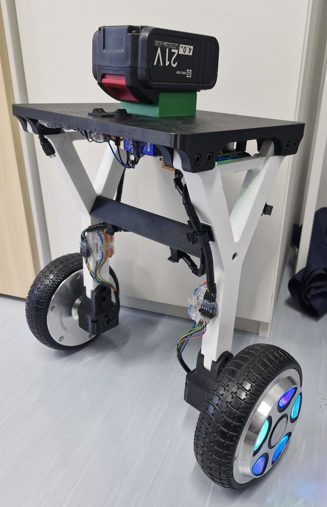 
> 

>
> `ESP32` `ODrive` `IMU` `PID Control` `3D Printing` `CAD`

<b>Brushless Motor Controller GUI</b> — Python, PyQt5, ODrive

 

> Built a PyQt5 desktop application for ODrive brushless motor configuration and testing.  
> 
> - Set and tune motor parameters (velocity, position, torque control)  
> - Live plotting of position, velocity, and torque curves  
>
> 

> 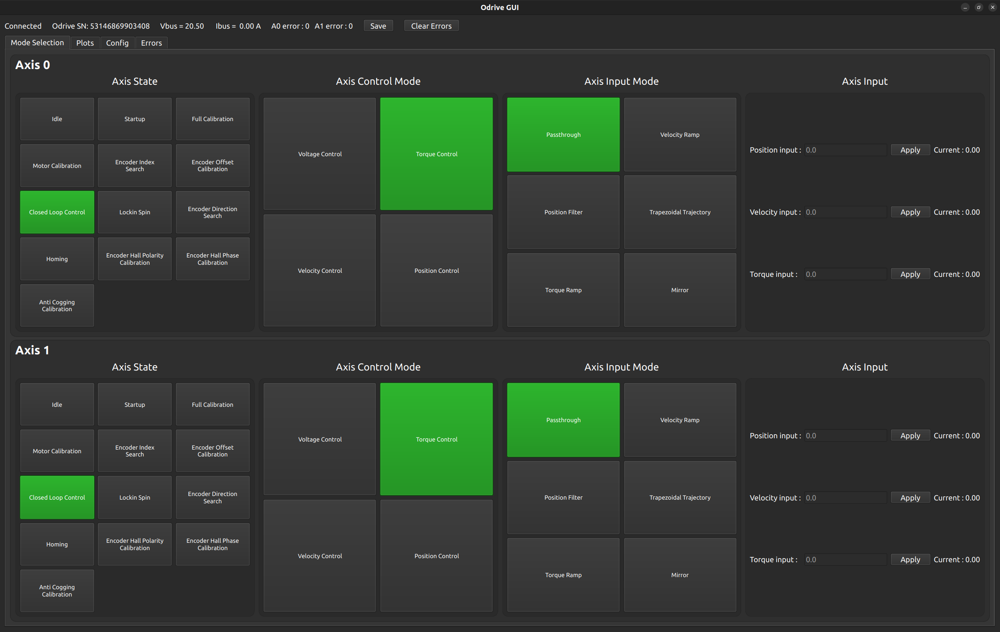  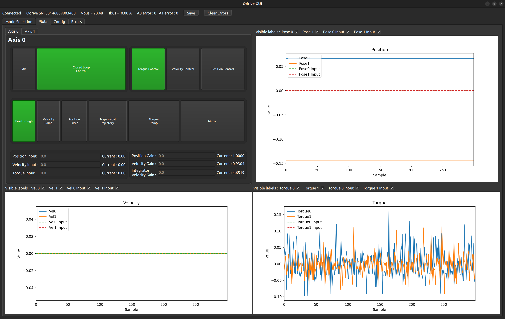   
> 

>
> `Python` `PyQt5` `ODrive`

<b>LED Car Light with ROS2 Control</b> — Python, PyQt5, ODrive

 

> Built a wireless RF-controlled front-light system for a robot (Arduino Nano, 433MHz RF, car LED bulbs, custom 3D-printed mount), with ROS2 integration to switch light behavior based on the robot's operating mode.  
>
> 

> 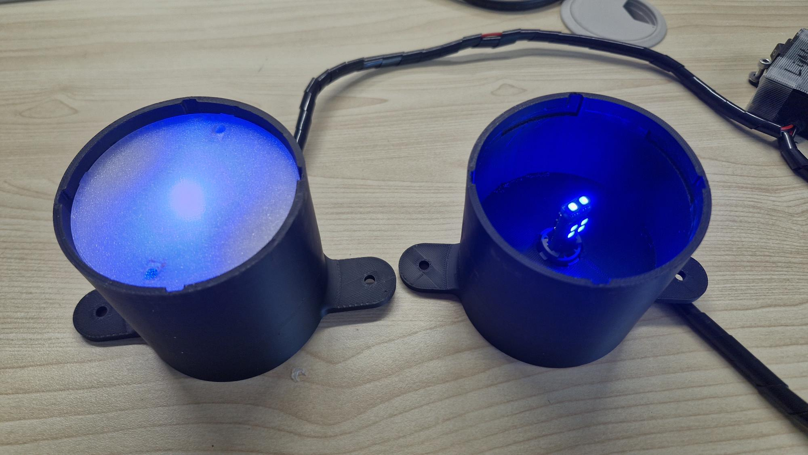  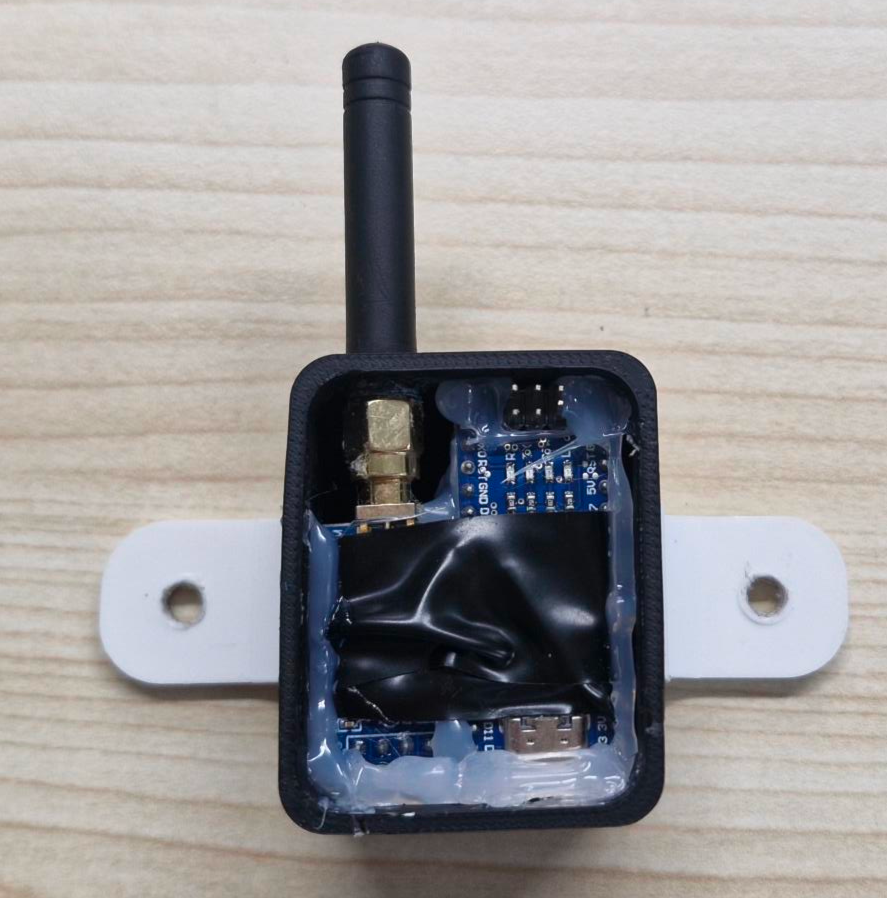  
> 

>
> `Arduino` `RF` `ROS2` `3D Printing`

<b>Robot Guitar</b> — Raspberry Pi, C++, Servomotors

 

> Built an actuator system to play an electric guitar (Ibanez) using a Raspberry Pi, C++, and 9g servomotors, with custom 3D-printed parts.
>
> - Currently plays open strings only — enough for the intro of Nothing Else Matters 🤘
> - Was working on fretboard actuation to play actual notes along the neck, but didn't have time to finish
> - Planned as a future project to extend beyond open strings
>
> 

> 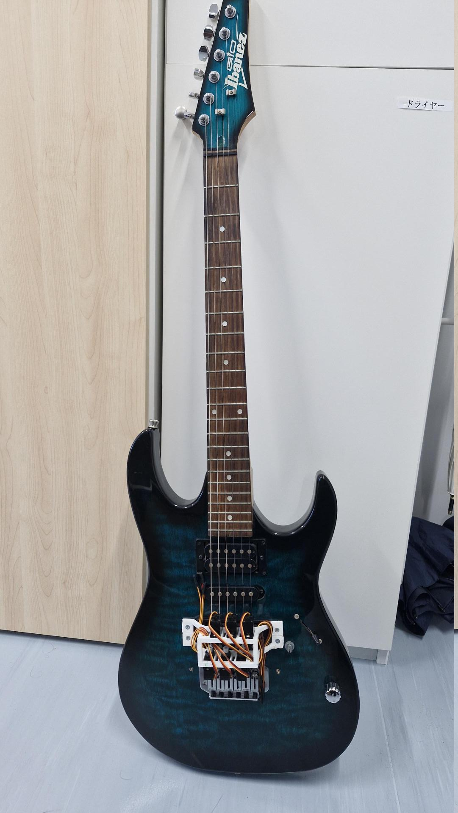
> 

>
> `Raspberry Pi` `C++` `9g Servomotors` `3D Printing`

## 📫 Contact

